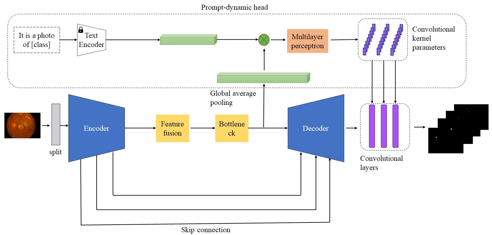

# MFEFNet

It is the official implementation of the paper "MFEFNet: Multiscale feature extraction fusion network for diabetic retinopathy lesion segmentation".



##Bulid  environment

You can use `environment.yml` to help you build the running environment for the code.

```
conda env create -f environment.yml -n MFEFNetenv
```

## Training

You can adjust the hyperparameters of the model in the file and then just run `mian.py`.

